# Fundus Vision
### AI-Based Retinal Disease Screening and Explainable Analysis System

Fundus Vision is a portfolio project that demonstrates an AI-assisted retinal disease screening workflow using the Eye Disease Image Dataset. The project focuses on multi-class fundus image classification, class imbalance handling, model comparison, and Grad-CAM-based explainability.

This repository is intended primarily for project presentation and result sharing. It documents the workflow, experiments, visual analysis, and demo implementation created from Google Colab outputs.

---

## Project Overview

Retinal diseases such as diabetic retinopathy, glaucoma, and retinal detachment can lead to severe vision loss if they are not detected early. Large-scale screening is difficult in many clinical environments because expert review is limited and image characteristics vary across datasets.

This project builds an AI-assisted screening pipeline that classifies fundus images into 10 disease categories and provides visual explanations using Grad-CAM. The system is not intended to replace clinicians. It is designed as a research and educational prototype that shows how AI predictions can be paired with interpretable evidence.

### Key Features

- 10-class retinal disease classification
- Top-3 prediction output with probability scores
- Risk-level interpretation based on prediction confidence
- Class imbalance handling through two training strategies
- Class-wise performance analysis with confusion matrices
- Grad-CAM visual explanation for model reliability analysis
- Gradio-based interactive demo deployed on Hugging Face Spaces

---

## Live Demo

[Fundus Vision Demo](https://huggingface.co/spaces/Danso0614/fundus-vision)

The live demo allows users to upload a fundus image and view:

- Top-3 disease predictions
- Confidence-based risk level
- Grad-CAM heatmap and overlay visualization
- Simple recommendation text for educational use

### Demo and Model Weight Policy

The demo code is included in [`demo/app.py`](demo/app.py), and it expects a model checkpoint named `best.pt`.

This GitHub repository does not include the trained model weight file. The `best.pt` checkpoint is managed only in the Hugging Face Space environment for the deployed demo. Therefore, cloning this repository alone is sufficient to review the project structure, notebooks, figures, metrics, and demo source code, but it is not intended to provide a fully runnable local inference package.

For dependency information related to the demo, see [`demo/requirements.txt`](demo/requirements.txt). A separate root-level `requirements.txt` is intentionally not provided because this repository is organized as a portfolio and result-sharing repository rather than a full reproducibility package.

---

## Problem Definition

Deep learning models can achieve strong classification performance on fundus image datasets, but high overall accuracy is not enough for medical AI analysis. In medical imaging, it is also important to understand whether the model focuses on clinically meaningful regions and whether performance is reliable across disease classes.

This project investigates three main questions:

- Can a lightweight model classify 10 fundus disease categories effectively?
- How does severe class imbalance affect model behavior?
- Do Grad-CAM results suggest that the model is focusing on clinically relevant regions?

---

## System Architecture

The system follows a screening-style workflow:

1. Fundus image input
2. Image preprocessing
3. AI screening model inference
4. Top-3 disease prediction
5. Risk-level interpretation
6. Grad-CAM visual explanation
7. Human review support

<div align="center">
  
</div>

---

## Dataset

This project uses the Eye Disease Image Dataset, collected from multiple clinical sources.

### Data Source

- Anwara Hamida Eye Hospital
- BNS Zahrul Haque Eye Hospital
- Bangladesh

### Dataset Statistics

- Total images: 21,577
- Original images: 5,335
- Augmented images: 16,242
- Number of classes: 10

### Disease Classes

- Central Serous Chorioretinopathy
- Diabetic Retinopathy
- Disc Edema
- Glaucoma
- Healthy
- Macular Scar
- Myopia
- Pterygium
- Retinal Detachment
- Retinitis Pigmentosa

---

## Exploratory Data Analysis

EDA was conducted to understand dataset characteristics and identify issues that could affect model performance and generalization.

### Key Observations

- Severe class imbalance exists across disease categories.
- Image brightness and quality vary across samples.
- Augmented images are included and may influence distribution.
- Class-wise evaluation is important because the dataset is not uniformly balanced.

### Class Distribution

<div align="center">
  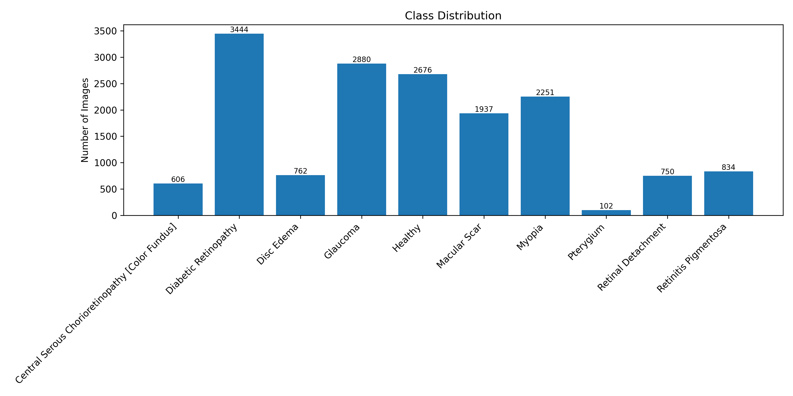<br/>
  <b>Class Distribution Across 10 Disease Categories</b>
</div>

### Sample Images

<div align="center">
  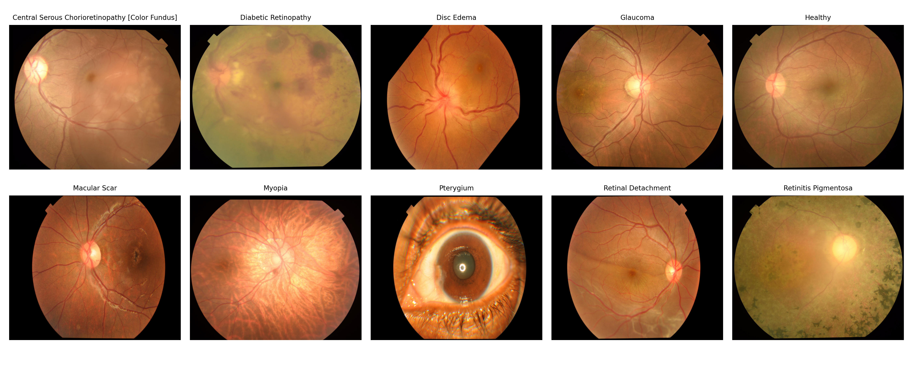<br/>
  <b>Representative Fundus Images for Each Class</b>
</div>

### Class Imbalance

<div align="center">
  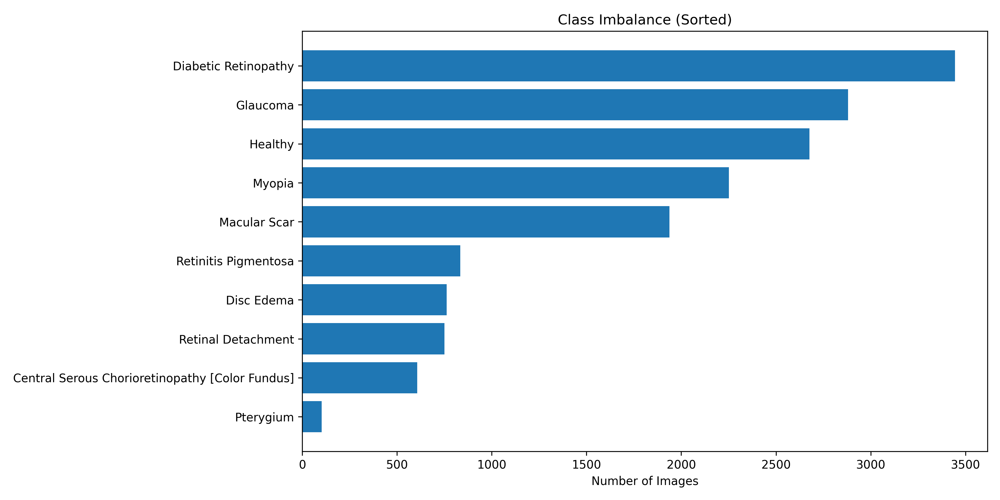<br/>
  <b>Class Imbalance Distribution</b>
</div>

### RGB and Resolution Analysis

<div align="center">
  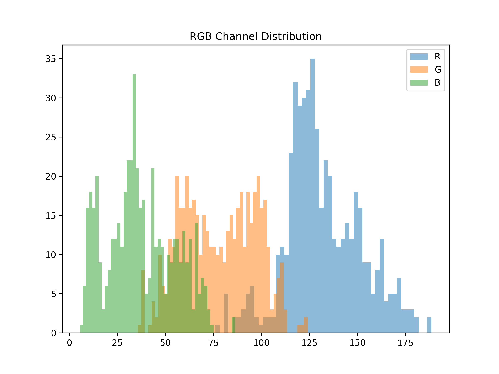<br/>
  <b>RGB Channel Intensity Distribution</b>
</div>

<br/>

<div align="center">
  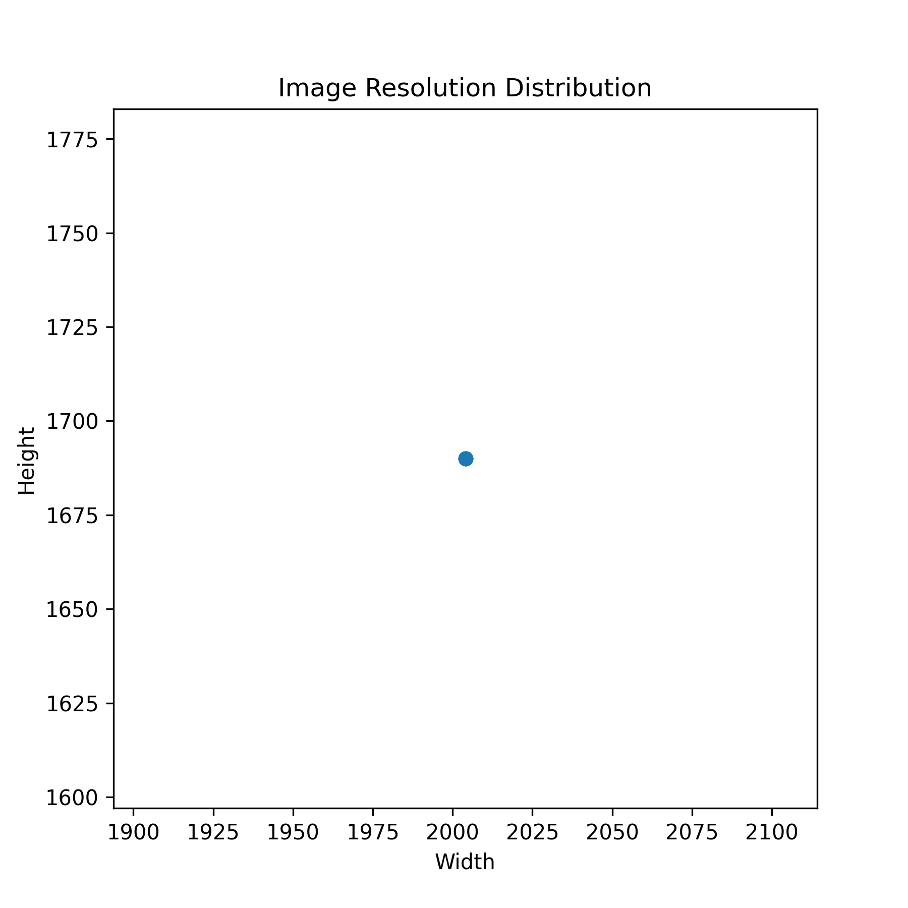<br/>
  <b>Image Resolution Distribution</b>
</div>

---

## Model and Training Strategy

The model is based on ConvNeXtV2 Tiny. This architecture was selected because it provides a practical balance between performance and computational efficiency, especially for Google Colab-based experimentation.

### Training Setup

- Framework: PyTorch
- Backbone: ConvNeXtV2 Tiny
- Input size: 224 x 224
- Optimizer: AdamW
- Scheduler: CosineAnnealingLR
- Mixed Precision Training: enabled
- Transfer learning with pretrained ImageNet weights

<div align="center">
  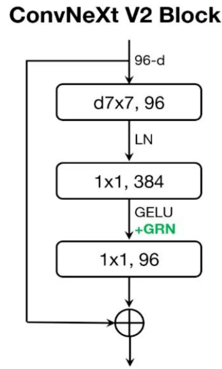<br/>
  <b>ConvNeXt-Tiny Architecture Overview</b>
</div>

### Class Imbalance Handling

Class imbalance was one of the most important challenges in this dataset. Two training strategies were compared:

#### Strategy A: Class Weight + Focal Loss

- Applies class weights to balance loss contribution
- Uses Focal Loss to focus learning on difficult samples
- Intended to reduce bias toward majority classes

#### Strategy B: Oversampling + Focal Loss

- Oversamples minority classes during training
- Uses Focal Loss for stable learning
- Intended to increase minority-class exposure

<div align="center">
  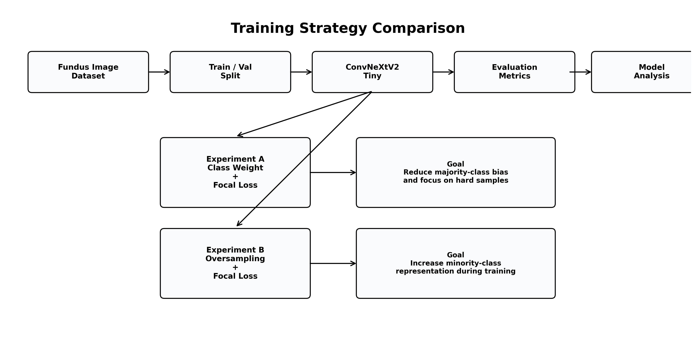<br/>
  <b>Training Strategy Comparison Pipeline</b>
</div>

---

## Experimental Results

The model achieved strong overall performance, but reliability varied by class. This makes class-wise analysis especially important for medical imaging tasks.

### Overall Performance

Best observed performance:

- Strategy A: Macro F1 approximately 0.90
- Strategy B: Macro F1 approximately 0.89

<div align="center">
  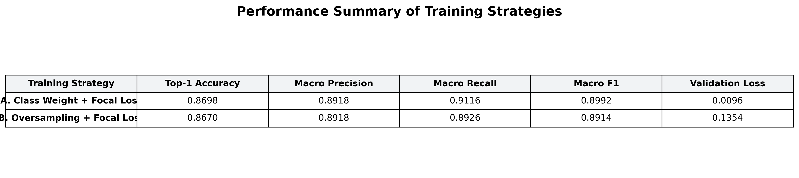<br/>
  <b>Performance Summary of Training Strategies</b>
</div>

<br/>

<div align="center">
  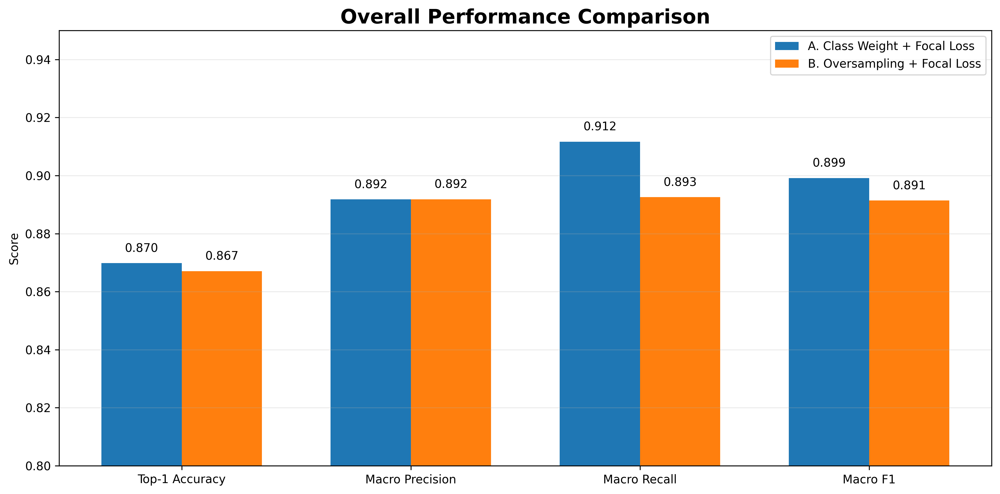<br/>
  <b>Overall Performance Comparison</b>
</div>

### Model Comparison Insight

Both strategies produced strong results. However, Strategy A, Class Weight + Focal Loss, showed more stable overall and class-wise behavior than the oversampling-based approach. Oversampling helped expose minority classes more often, but it may also increase repeated-sample effects and overfitting risk.

### Class-wise Performance

<div align="center">
  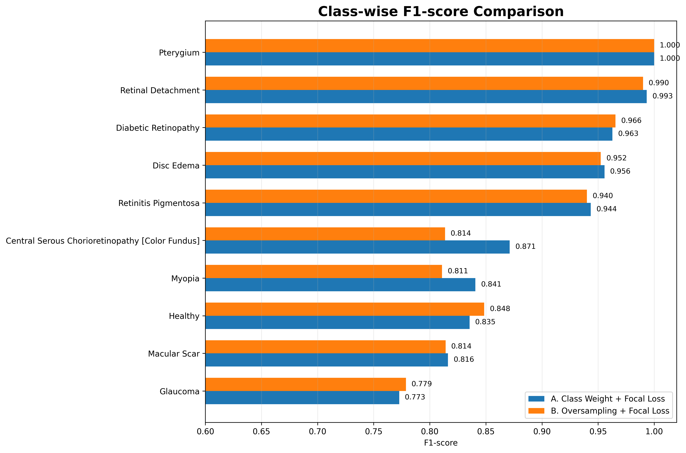<br/>
  <b>Class-wise F1-score Comparison</b>
</div>

<br/>

<div align="center">
  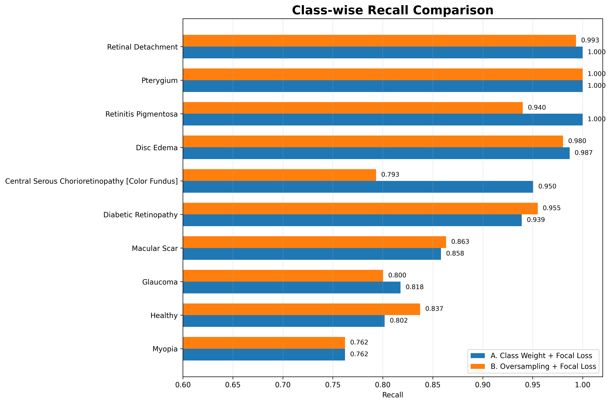<br/>
  <b>Class-wise Recall Comparison</b>
</div>

### Confusion Matrix Analysis

Row-normalized confusion matrices were used to compare class-wise prediction tendencies.

<table align="center">
  <tr>
    <td align="center">
      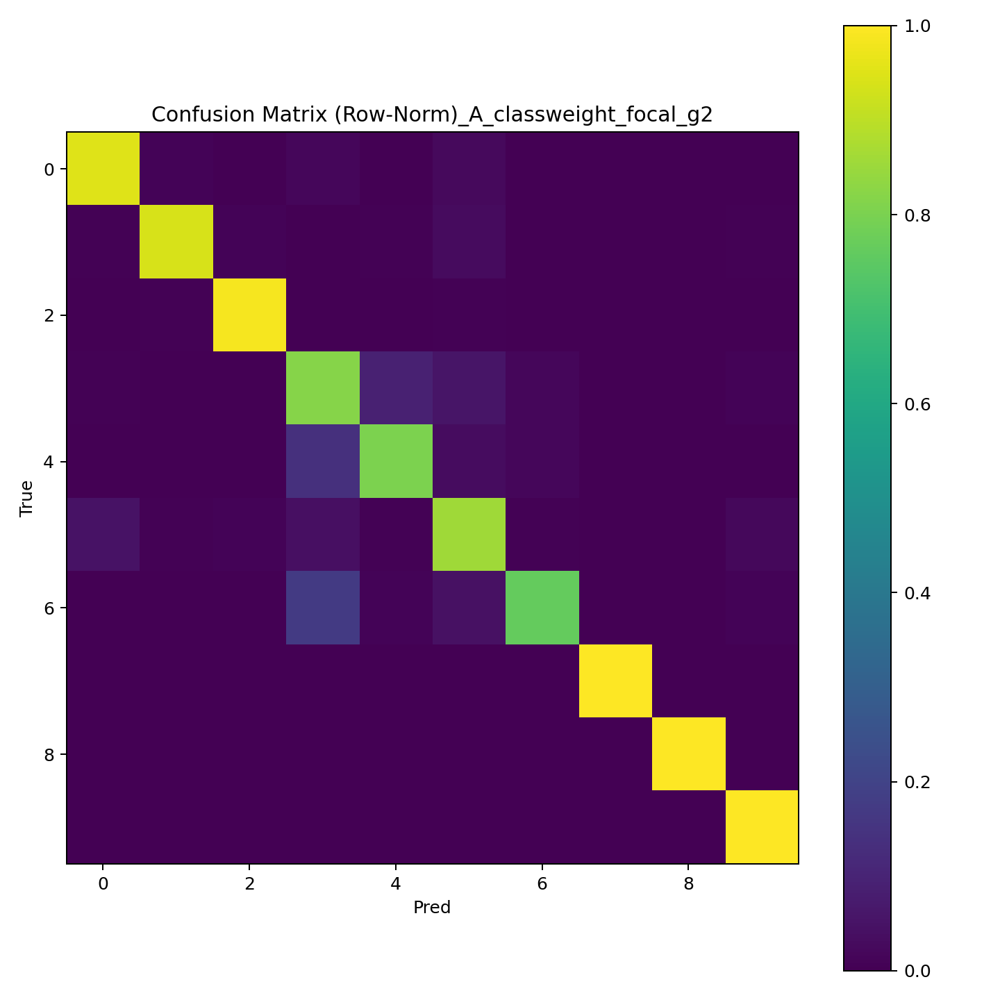<br/>
      <b>A.</b> Class Weight + Focal Loss
    </td>
    <td align="center">
      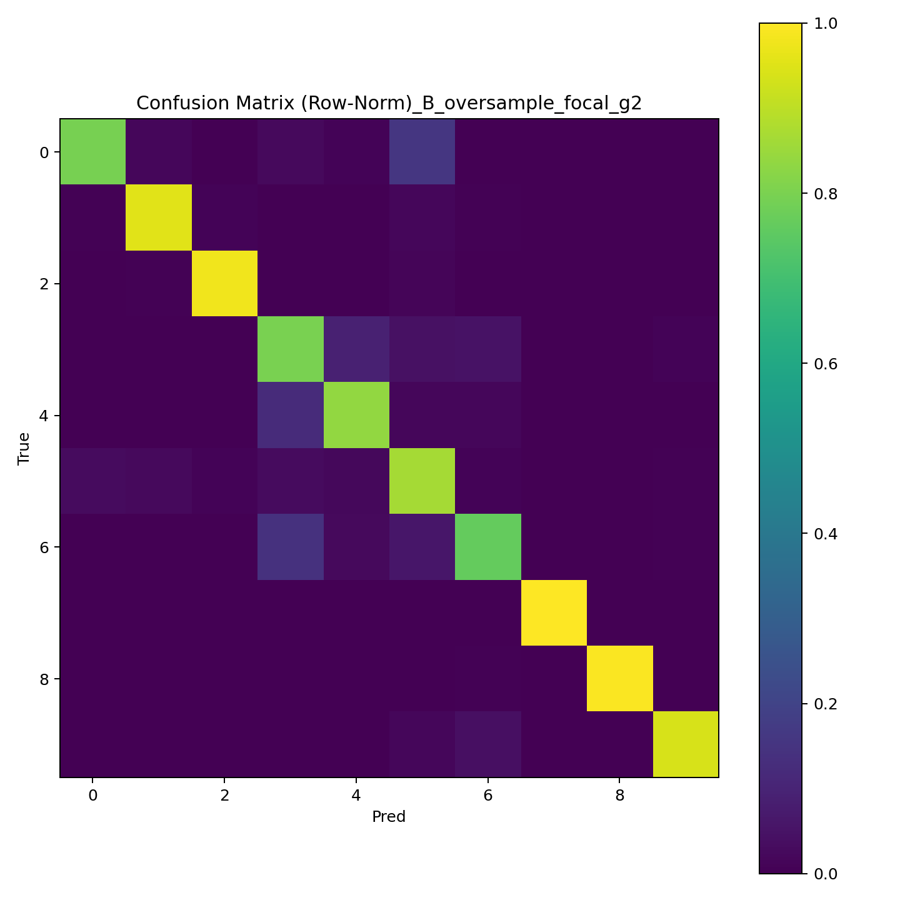<br/>
      <b>B.</b> Oversampling + Focal Loss
    </td>
  </tr>
</table>

Key observations:

- Most classes show strong diagonal dominance.
- Misclassification mainly appears among visually similar disease classes.
- Some classes show lower reliability because of subtle features or limited examples.

---

## Explainable AI with Grad-CAM

In medical imaging, explainability is important because model predictions need to be interpreted carefully. Grad-CAM was used to visualize which image regions influenced the model prediction.

The goal was not only to produce heatmaps, but also to assess whether attention patterns were clinically meaningful and consistent across disease categories.

### Example: Glaucoma

<table align="center">
  <tr>
    <td align="center">
      <br/>
      <b>Original / Heatmap / Overlay Visualization</b>
    </td>
  </tr>
</table>

The model primarily focuses on the optic disc region when predicting glaucoma, which is clinically relevant because glaucoma is associated with structural changes around the optic disc. Some attention maps still spread beyond the target region, showing that the model has limitations in fine-grained localization.

---

## Class-wise Model Reliability

Grad-CAM examples were grouped into reliability categories based on consistency, relevance, and focus.

### Good

- Diabetic Retinopathy
- Retinitis Pigmentosa
- Glaucoma

These classes showed relatively consistent focus on meaningful regions.

### Partial

- Macular Scar
- Central Serous Chorioretinopathy
- Disc Edema
- Retinal Detachment

These classes showed partially relevant but less stable attention patterns.

### Poor

- Pterygium
- Myopia
- Healthy

These classes showed weaker or less clinically meaningful focus in representative Grad-CAM examples.

<table align="center">
  <tr>
    <td align="center">
      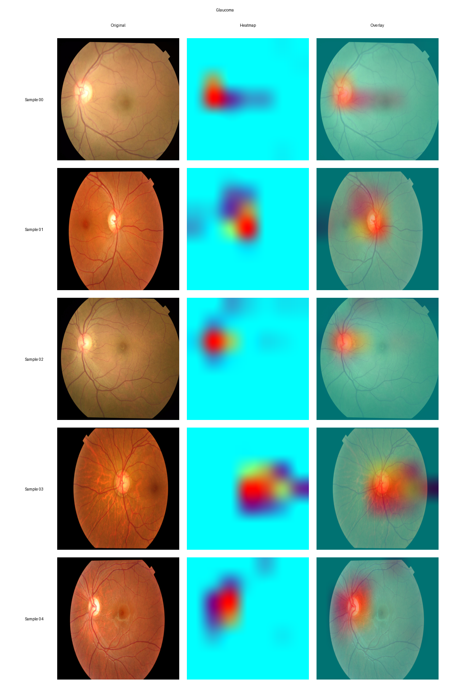<br/>
      <b>Good</b><br/>
      Glaucoma
    </td>
    <td align="center">
      <br/>
      <b>Partial</b><br/>
      Disc Edema
    </td>
    <td align="center">
      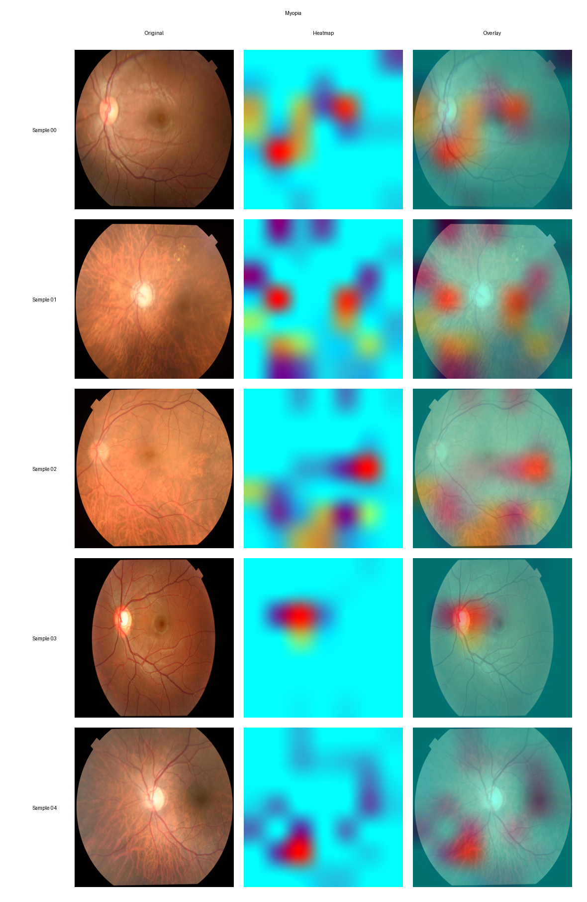<br/>
      <b>Poor</b><br/>
      Myopia
    </td>
  </tr>
</table>

---

## Limitations

- This project is for research, learning, and portfolio presentation only.
- The model is not a certified medical device.
- It should not be used as a replacement for medical diagnosis.
- Performance may vary under real-world image quality and dataset shifts.
- Some disease classes show unstable Grad-CAM attention.
- The repository does not include the trained model checkpoint.

---

## Future Work

- Improve reliability for underrepresented and visually ambiguous classes.
- Evaluate the model on external validation datasets.
- Compare Grad-CAM with additional explainability methods.
- Improve lesion-focused localization.
- Optimize inference for real-time deployment.
- Explore clinical decision-support integration in a validated setting.

---

## Repository Structure

The repository is organized to preserve the current project workflow and Colab-generated outputs.

```text
ai-fundus-disease-screening
|
|-- README.md
|
|-- figures/
|   |-- architecture/
|   |   `-- ConvNext-Tiny-structure.png
|   |
|   |-- eda/
|   |   |-- class_distribution.png
|   |   |-- class_imbalance.png
|   |   |-- resolution_analysis.png
|   |   |-- rgb_analysis.png
|   |   `-- sample_images.png
|   |
|   |-- results/
|   |   |-- ab_overall_performance.png
|   |   |-- classwise_f1_comparison.png
|   |   |-- classwise_recall_comparison.png
|   |   |-- confusion_matrix_norm_A_classweight_focal_g2.png
|   |   |-- confusion_matrix_norm_B_oversample_focal_g2.png
|   |   |-- experiment_design_diagram.png
|   |   `-- performance_summary_table.png
|   |
|   `-- gradcam/
|       |-- Disc Edema_example.png
|       |-- Glaucoma_example.png
|       `-- Myopia_example.png
|
|-- notebooks/
|   |-- 01_EDA_and_Data_Preparation.ipynb
|   |-- 02_Baseline_Training_clean.ipynb
|   |-- 03_Experiment_A_ClassWeight_FocalLoss_clean.ipynb
|   `-- 04_Experiment_B_Oversampling_FocalLoss_clean.ipynb
|
|-- results/
|   |-- classification_report_A_classweight_focal_g2.csv
|   |-- classification_report_B_oversample_focal_g2.csv
|   |-- metrics_summary_A_classweight_focal_g2.csv
|   `-- metrics_summary_B_oversample_focal_g2.csv
|
`-- demo/
    |-- README.md
    |-- app.py
    `-- requirements.txt
```

---

## Notes

- The notebooks document the Google Colab-based workflow used to generate the project outputs.
- Figures and CSV files are retained as project artifacts for presentation and review.
- The Hugging Face Space manages the deployed demo environment and model checkpoint.
- This repository prioritizes clear project communication over full local reproducibility.
